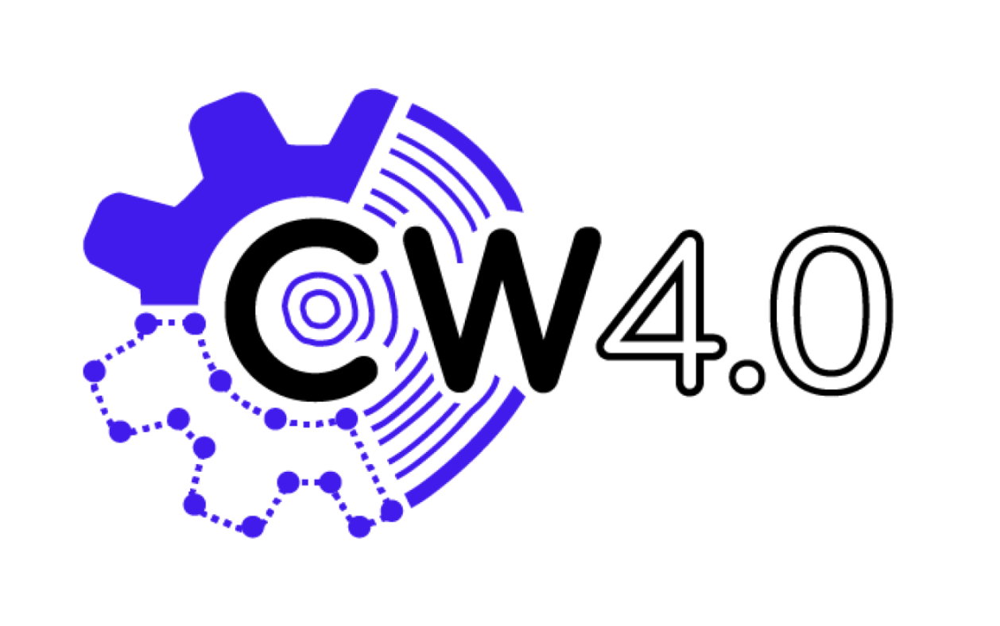

# CircularWood_4.0 Workflow API

This repository contains the **CircularWood_4.0 Workflow API**, developed as part of the Circular Wood 4.0 project at the Robot Lab - Digital Production Research Group - Amsterdam University of Applied Science.

Contact: j.jooshesh@hva.nl
Javid Jooshesh - Researcher in Robot Lab 

## Project Overview

The primary purpose of the API is to provide a database infrastructure that integrates **design creation**, **material management**, and **production automation**. Here's how the process works:
    <br>
The **CW4.0 Workflow API** is a comprehensive, automated “file-to-factory” system that connects design, database management, and production processes within the Circular Wood 4.0 project. This IT infrastructure supports an automated workflow, ensuring efficient data flow from design to production with traceability and real-time process monitoring. The workflow API is composed of several interconnected components.

##### 1. Database API
At its core, the "Database API" which functions as a "REST" interface to a PostgreSQL database, managing data across several tables: ‘wood’, ‘design’, ‘design_metadata’, ‘production’, ‘users’, and ‘process_history’.

##### 2. Design Client
The "Design Client", which utilises Rhinoceros Grasshopper3D and a custom-developed HTTP client plugin, facilitates seamless communication between the design software and the database. Designers can authenticate through the plugin, enabling them to search for available materials in the wood stock. Once a selection is made, the plugin uses a greedy algorithm to optimise wood plank selection based on available resources and the length and width of the design parts. This process matches designs to the selected wood and nests the design geometries within each plank, minimising waste. By using a relational database such as PostgreSQL, the system establishes relationships between each design element and specific wood planks. For example, if a wood plank with ID ‘1’ is used to produce the first three design elements, the nested design IDs [‘1’, ‘2’, ‘3’] are linked to wood ID ‘1’ in a one-to-many relationship. This data, along with design metadata, is sent back to the database, reserving the selected wood IDs for 72 hours under the user’s name.

##### 3. Production Pipeline
The "Production Pipeline" component, handles the process of generating the CAM instructions  executed in Siemens NX. It involves retrieving design data by project title, extracting geometry (STP format), importing it into the SIEMENS NX CAM environment, and generating production instructions for each design part. These instructions are stored in the database with unique IDs linked to both the wood and design IDs. This ensures that CAM instructions for producing specific design parts are traceable, linked to specific wood planks and design elements, and can be looked up from the ‘design’, ‘wood’, or ‘production’ tables, and vice versa.


##### 4. Production Run
The "Production Run" is managed by the ‘Production Gateway’ application, developed as part of the API, and controlled by a programmable logic controller (PLC) unit. At the pickup point in the factory, a barcode scanner reads the wood ID from the printed label on the material. The application then fetches the corresponding chain of production instructions and delivers them to the robot controllers via a file transfer protocol. The PLC then coordinates the entire production sequence, handles the communication, and updates the gateway application with event data for monitoring, and logs these updates in the database to track the impact and KPIs of each run. 

This integrated approach makes the entire process smoother and more efficient, supporting sustainable practices and ensuring a seamless transition from design to final production.

---
# Developer information

## Requirements

- **Docker**: Ensure Docker is installed on your machine. You can download it from [here](https://www.docker.com/products/docker-desktop).
- **docker-compose**: Use docker-compose to manage and run the api inside a container as service.
- **Python 3.10**: Used for certain setup scripts and database migrations.

---

## Installation

1. **Clone the repository**:

   ```bash
   git clone <repository-url>
   cd circularwood_4.0_api
   ```
   <br>
   
2. **Set up environment**:
    Review and adjust the settings.yml file to suit your environment. Ensure that API port configurations, database connections, and logging levels are set correctly.
    <br>

3. **Build and run the project using Docker for development**:
    `docker-compose up --build`

    This will start the necessary containers, and the API will be available at <http://localhost:5050> (as configured in settings.yml).

---

## Documentation

For the **API documentation** execute the following script in the terminal:

```bash
$ ./api-docs.sh
```

For the **developer documentation**, execute the following script in the terminal:

```bash
$ ./developer-docs.sh
```

---

# Configurations

This section provides an overview of the settings available for configuring the CircularWood_4.0 Workflow API. These configurations allow for easy customization and adaptation to different environments, external services, and security needs.
    <br>

## Database API
### API Configs
such as CORS & Rate Limiting: Control who can access the API and limit requests to prevent overuse.

``` yaml
    configs:
        secret_key: 4e5508fd-979d-47ad-a56b-e9a604d02f1f
        propogate_exceptions: true
        rate_limiting:
            requests_per_minute: 100
            burst: 50
        cors:
            access_control_allow_credentials: true
            allow_headers: [ ... ]
            allowed_origins: [ ... ]
        max_content_length: 10485760 # 10MB
```
<br />

### External APIs
 Add or modify the URLs of external services like authentication or environmental data APIs.

```yaml
external:
    apis:
        url:
            - &dev_auth_api_url <http://localhost:1993>
        api_keys: []
    tools:
        idemat:
        path: idemat/idenmat_2023_wood_simplified.json
```
<br>

 ### Frontend Applications
 Update URLs to any frontend applications connected to the Database API.

```yaml
frontend_apps:
url:
    - http://localhost:3000
    - https://robotlab-db-gui.onrender.com
```
<br>

 ### Server Settings
 Adjust the port, host, and environment (development vs. production).
```yaml
server:
port: 5050
host: 0.0.0.0
environment:
    selected_mode: "development"
    modes: 
    development:
        url: http://localhost:5050
        logging: DEBUG
    production:
        url: https://robotlab-residualwood.onrender.com
        logging: INFO
```
<br>
 
 ### Database
 Switch from SQLite to a production-ready database like PostgreSQL, MySQL, etc.

```yaml
database:
    server: sqlite
    uri: sqlite:///instance/data.db
    track_modifications: false
```
<br>

 ### Security
 Customize cookie handling and JWT settings to secure your API.

```yaml
security:

    cookie_settings:
        same_site: 'Strict'
        token_location: "cookies"
        cookie_secure: false
        csrf_in_cookies: false
        http_only: true
        
    jwt:
        secret: "ROBOT-LAB_118944794548470618589981863246285508728"
        issuer: https://robotlab-residualwood.onrender.com
        audience: https://robotlab-residualwood.onrender.com
        expiration_time: 3600
```
<br>

### Logging
 Modify the logging format and where logs are written.

```yaml
logging:
    format: json
    output: stdout
```
<br>

## Design Client
### <NOT_FINISHED>

## Production Run

### General settings

``` yaml
production_run:
    title: PRODUCTION_GATEWAY
    network_configuration:
        type: LAN
        settings:
            dhcp: manual
            ethernet:
                interface: eth0
                ipv4:
                    dns:
                        gateway_ip: 10.0.0.1
                        broadcast_ip: 10.0.0.255
                        subnet_mask: 255.255.255.0
```

### Hardware Configurations
``` yaml
    hardware_components:
        control_system:
            unit: PLC
            model: SIEMENS_SIMATIC_S7-300
        equipment:
            robots:
                - title: BLUE
                    controller_series: IRC5
                    model: ABB_IRB4600-60_205
                    device: GRIPPER
            auxiliary_devices:
                - title: LECTOR
                    unit: IMAGE_BASED_CODE_READER
                    model: SICK_Lector61X
                    commands:
                        start_command: 21
                        stop_command: 22
                    framing:
                        opening: "\x02"
                        end: "\x03"
``` 
<br />

### Communication Protocols Configurations
The settings and parameters used for each communication layer of the application during the prodcution run are adjusted under the `communication_protocols` field
<br />

1. FTP Protocol
Instruction delivery to the robot controllers from the gateway application
``` yaml
    # communication_protocols:
        ftp:
            robot_configuration:
                red_robot:
                    ip: 10.0.0.14
                    credentials:
                        username: "<env:FTP_USER>"
                        password: "<env:FTP_PASSWORD>"
                    directory: /RED_MILLING
```
<br />

2. TCP Protocol
For procedure calls to devices via socket connection
``` yaml
    # communication_protocols:      
        tcp:
            connections:
                lector:
                    ip: 10.0.0.45
                    ports:
                        command_port: 2112
                        response_port: 1024
```
<br />

3. MQTT Protocol
Communicates as the event broker between the database, gateway application and the system controllers
``` yaml
    # communication_protocols:
        mqtt:
            broker_info:
                ip: 10.0.0.9
                port: 1883
            topics:
                production:
                    [...]
                robots:
                    from_robot_to_plc:
                        blue:
                            request_part_data: PLC_coms/stoolReady
                        red:
                            fetch_rapid: [...]
                status_flags:
                    pickup:
                        [...]
```
<br />

4. HTTP Protocol
Used for communication with the database API
``` yaml
    # communication_protocols:
        http:
            database_service:
                environments:
                    development:
                        base_url: http://localhost:5050
                    production:
                        base_url: https://robotlab-residualwood.onrender.com
                credentials:
                    username: <ADMIN_USERNAME>
                    password: <ADMIN_PASSWORD>
                endpoints:
                    post:
                        authentication:
                            path: "/login"
                            auth_required: false
                    get:
                        wood_by_id:
                            path: "/wood/{wood_id}"
                            auth_required: false
```
<br />

5. Profinet Protocol
``` yaml
    # communication_protocols:
        
        profinet:
            section: StoolProduction
            # documentation: "https://icthva.sharepoint.com/sites/ft-engineering-rola/Gedeelde%20documenten/[DOCUMENTATION]%202024-2025%20sem%201%20pre-makeathon%20PLC%20communications.pdf"
```

## Contributing

Before starting with any contribution, please read the CONTRIBUTING document in the respository